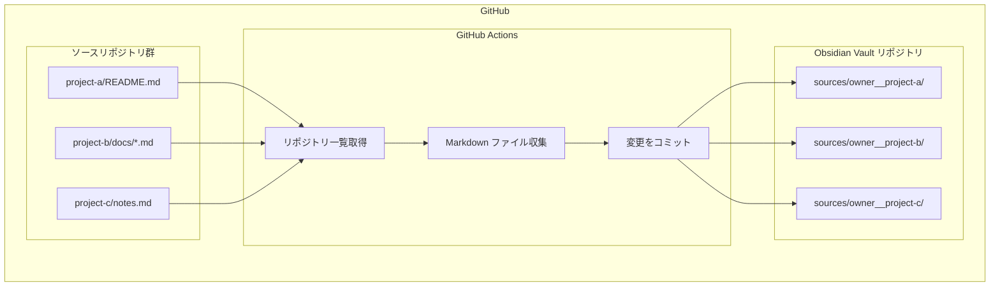

# はじめに

私は GitHub のリポジトリごとに、そのプロジェクトで得た学びや知見を Markdown で記録しています。README にプロジェクトの概要を書き、docs フォルダに技術的な詳細やトラブルシューティングの記録を残すといった具合です。

しかし、これらのドキュメントが各リポジトリに散在していると、過去の学びを探すのが大変です。「あの実装方法、どのプロジェクトに書いたっけ？」となることもしばしば。

そこで、GitHub に蓄積した Markdown ドキュメントを 同じく GitHub 上で管理しているObsidian のナレッジベースに自動集約する仕組みを作りました。GitHub Actions を使って毎日自動的に全リポジトリから Markdown を収集し、Obsidian で横断的に検索できるようにしました。

# 構成図



毎日 3:00 (JST) または手動実行により、GitHub の全パブリックリポジトリから Markdown を収集します。

# 完成したワークフロー

```yaml
name: Collect my public Markdown (no forks, exclude self)

on:
  schedule:
    - cron: "0 18 * * *"   # 毎日 03:00 JST
  workflow_dispatch:

jobs:
  collect:
    runs-on: ubuntu-latest
    permissions:
      contents: write
    env:
      OWNER: ${{ github.repository_owner }}
      DEST_ROOT: sources

    steps:
      - name: Checkout this repository
        uses: actions/checkout@v4

      - name: Discover my public repos (exclude forks & self)
        shell: bash
        env:
          GH_TOKEN: ${{ github.token }}
        run: |
          set -euo pipefail
          SELF_REPO="$GITHUB_REPOSITORY"
          gh repo list "$OWNER" --visibility=public --limit 2000 \
            --json nameWithOwner,isFork \
            --jq '.[] | select(.isFork|not) | .nameWithOwner' \
            | grep -Fxv "$SELF_REPO" \
            | sort -u > sources.txt
          echo "Targets:"; cat sources.txt || true

      - name: Collect .md from repos
        shell: bash
        run: |
          set -euo pipefail
          mkdir -p "$DEST_ROOT"
          WORKDIR="$(mktemp -d)"
          trap 'rm -rf "$WORKDIR"' EXIT

          while IFS= read -r REPO; do
            [ -n "$REPO" ] || continue
            OWNER_PART="${REPO%%/*}"
            NAME_PART="${REPO##*/}"
            DEST_PATH="${DEST_ROOT}/${OWNER_PART}__${NAME_PART}/"
            mkdir -p "$DEST_PATH"

            echo "::group::Clone $REPO"
            git -c advice.detachedHead=false clone --depth=1 "https://github.com/${REPO}.git" "$WORKDIR/src"
            echo "::endgroup::"

            rsync -a \
              --include='*/' --include='*.md' --exclude='*' \
              "$WORKDIR/src/" "$DEST_PATH"

            rm -rf "$WORKDIR/src"
          done < sources.txt

      - name: Commit & push if changed
        shell: bash
        run: |
          set -euo pipefail
          git config user.name  "obsidian-collector-bot"
          git config user.email "obsidian-collector-bot@users.noreply.github.com"
          if [ -n "$(git status --porcelain)" ]; then
            git add -A
            git commit -m "update: collect my public markdown"
            git push
          else
            echo "No changes."
          fi
```

このワークフローは毎日 3:00 (JST) に自動実行され、手動でも実行可能です。収集された Markdown ファイルは以下のような構造で保存されます：

```
sources/
├── yourname__project-a/
│   ├── README.md
│   └── docs/
│       └── guide.md
└── yourname__project-b/
    └── README.md
```

# ワークフローの仕組み

## リポジトリ一覧の取得

最初のステップでは、GitHub CLI を使って自分のパブリックリポジトリ一覧を取得します。

```bash
gh repo list "$OWNER" --visibility=public --limit 2000 \
  --json nameWithOwner,isFork \
  --jq '.[] | select(.isFork|not) | .nameWithOwner' \
  | grep -Fxv "$SELF_REPO" \
  | sort -u > sources.txt
```

処理の流れ：

1. `gh repo list` で自分のパブリックリポジトリを取得
2. `select(.isFork|not)` で他人のリポジトリをフォークしたものを除外
3. `grep -Fxv "$SELF_REPO"` で Obsidian Vault リポジトリ自身を除外（無限ループ防止）
   - `-F`: 正規表現でなく固定文字列として扱う
   - `-x`: 行全体の完全一致
   - `-v`: マッチしない行を出力（除外）
   - これにより `owner/obsidian` は除外されるが、`owner/obsidian-backup` のような部分一致は除外されない
4. 結果を `sources.txt` に保存

## Markdown の収集

各リポジトリからに Markdown ファイルを収集します：

```bash
git -c advice.detachedHead=false clone --depth=1 "https://github.com/${REPO}.git" "$WORKDIR/src"
rsync -a --include='*/' --include='*.md' --exclude='*' "$WORKDIR/src/" "$DEST_PATH"
```

- `--depth=1` で最新のコミットのみをクローン（shallow clone）
- `rsync` で `.md` ファイルのみを選択的にコピー
- 一時ディレクトリ（`mktemp -d`）でクローンし、`trap` で確実にクリーンアップ

## 自動コミット

収集したファイルに変更がある場合のみ、コミット・プッシュします：

```bash
if [ -n "$(git status --porcelain)" ]; then
  git add -A
  git commit -m "update: collect my public markdown"
  git push
fi
```

# 注意点

このワークフローは **GitHub → Obsidian の一方向同期**です。Obsidian 側で収集されたファイルを編集しても、次回のワークフロー実行時に GitHub の内容で上書きされます。

- 編集は必ず GitHub リポジトリ側で行う
- Obsidian は閲覧・検索用として使う
- Obsidian 独自のメモは `sources/` 以外のフォルダに作成する

# まとめ

このワークフローにより、GitHub に散在する自分のドキュメントが Obsidian に自動集約されるようになりました。毎日の自動実行で常に最新の状態を保ちつつ、Obsidian の強力な検索やリンク機能でドキュメント間を自由に行き来できます。

応用として、収集対象をプライベートリポジトリに拡張したり、Markdown 以外のドキュメント（`.txt`、`.adoc` など）を含めることもできます。自分のナレッジベースを GitHub と Obsidian で一元管理したい方は、試してみてください。
