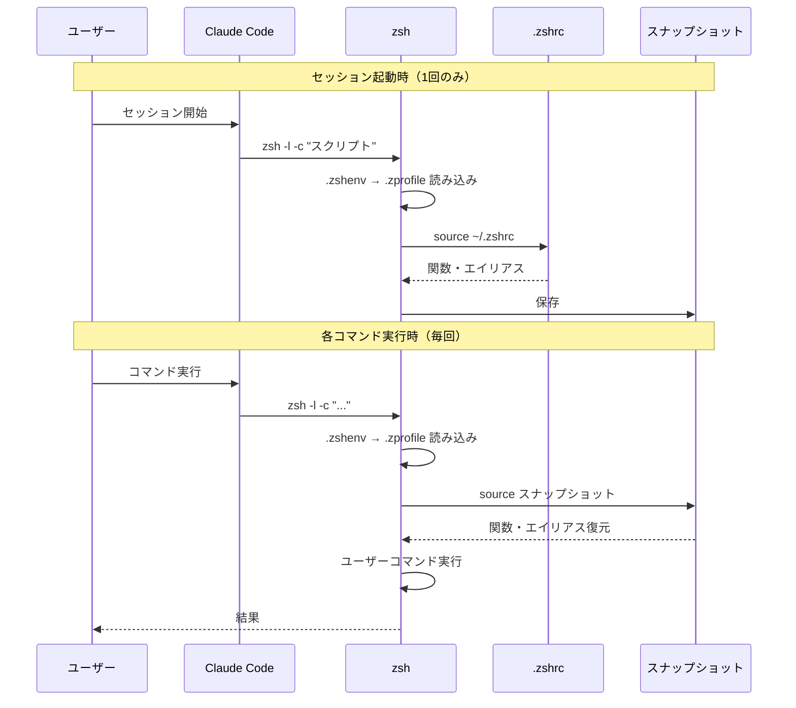

## はじめに

:::message
この記事はClaude Codeの内部実装を調べてみた記事です。実践的なノウハウやTipsは含まれていません。「仕組みを知りたい」という興味本位で、気楽にお読みください。
:::

調査環境: macOS, zsh, Claude Code 2.1.38

Claude Code内では、普段ターミナルで使っている `ll` や `gs` といったエイリアスがそのまま使えます。しかし、通常の非インタラクティブシェルでは `.zshrc` が読み込まれないため、エイリアスは使えないはずです。

例えば、Neovimで `:!gs` を実行すると、以下のようになります。

```vim
:!gs
zsh:1: command not found: gs

shell returned 127
```

エイリアスは認識されません。通常のスクリプトでも同様です。

```bash
$ cat > test.sh << 'EOF'
#!/bin/zsh
ll  # .zshrcで定義したエイリアス
EOF

$ chmod +x test.sh
$ ./test.sh
./test.sh:2: command not found: ll
```

それなのに、Claude Codeでは動く。一体どうやって実現しているのでしょうか？

この疑問から、Claude Codeの内部実装を調査してみました。

## 問題の本質

### シェルの種類と設定ファイル

シェルには「インタラクティブ」と「非インタラクティブ」という区別があります。

| | インタラクティブ | 非インタラクティブ |
|---|---|---|
| 例 | ターミナルで対話的に使う | スクリプト実行 |
| プロンプト | あり | なし |
| `$-` の内容 | `i` が含まれる | `i` がない |

そして、zshの設定ファイルの読み込みルールは以下の通りです。

| | 読み込まれるファイル |
|---|---|
| インタラクティブ | `.zshenv` → `.zprofile` → `.zshrc` |
| 非インタラクティブ | `.zshenv` のみ |

`.zshrc` はインタラクティブシェルの時のみ読み込まれます。エイリアスや関数は通常 `.zshrc` に定義するため、スクリプト実行では使えないのです。

### Claude Codeのシェルは非インタラクティブ

実際にClaude Code内で確認してみます。

```bash
$ echo $-
569Xl  # 'i' がない → 非インタラクティブ

$ alias ll
ll='eza -la --icons'  # それなのにエイリアスがある！

$ ll
# → 動作する
```

非インタラクティブなのにエイリアスが使える。どうやって実現しているのでしょうか？

## スナップショット機構の発見

調べてみると、Claude Codeは `~/.claude/shell-snapshots/` にファイルを作成していることがわかりました。

このファイルの中身を見てみます。

```bash
# Snapshot file
# Unset all aliases to avoid conflicts with functions
unalias -a 2>/dev/null || true

# Functions
bashcompinit () { ... }
gbr () { ... }  # .zshrcで定義されたユーザー関数
gc () { ... }

# Aliases
alias ll='eza -la --icons'
alias gs='git status'
...

# Environment variables
export PATH='/Users/...'
```

`.zshrc` で定義した関数やエイリアスが、すべてこのファイルに保存されていました。

### ファイルの構造

スナップショットファイルは以下の構造になっています。

| 項目 | 内容 |
|---|---|
| 保存場所 | `~/.claude/shell-snapshots/` |
| ファイル名 | `snapshot-zsh-<タイムスタンプ>-<ランダム文字列>.sh` |
| 内容 | 関数定義、エイリアス、環境変数 |

ライフサイクルは以下の通りです。
- 作成: Claude Codeのセッション起動時
- 削除: 正常終了時
- 保持: 異常終了時（残ってしまう）

## 仕組みの全体像

Claude Codeは、セッション起動時の環境キャプチャと各コマンド実行時の環境復元という2段階で環境を再現しています。



### 1. セッション起動時（1回のみ）

1. `zsh -l -c "スナップショット作成スクリプト"` を実行
2. `.zshenv` → `.zprofile` を読み込む
3. `source ~/.zshrc < /dev/null`
4. 関数・エイリアスを抽出
5. スナップショットファイルに保存

### 2. 各コマンド実行時（毎回）

1. `zsh -l -c "..."` を起動
2. `.zshenv` → `.zprofile` を読み込む
3. `source <スナップショット>` で復元
4. ユーザーコマンドを実行

一度だけ環境をキャプチャして、毎回それを復元する設計です。スナップショットには関数定義とエイリアスが保存されています。そのため、`.zshrc` の複雑な処理を毎回実行する必要がなく、効率的に動作します。

なお、セッション起動後に `.zshrc` を変更した場合は、Claude Codeを再起動しないと変更は反映されません。

## 実装の工夫

### 1. スナップショット作成の詳細

Claude Codeの実装（`cli.js`）では、スナップショット作成スクリプトを生成する関数が定義されています。

```javascript
async function mSY(A,q,K){
  let Y=qyA(A),  // .zshrc または .bashrc のパス
  ...
  return`SNAPSHOT_FILE=${L7([q])}
    ${K?`source "${Y}" < /dev/null`:"# No user config file to source"}

    # First, create/clear the snapshot file
    echo "# Snapshot file" >| "$SNAPSHOT_FILE"

    # Unset all aliases to avoid conflicts with functions
    echo "unalias -a 2>/dev/null || true" >> "$SNAPSHOT_FILE"

    ${w}  // 関数定義を出力
    ${H}  // 環境変数を出力
    ...
  `
}
```

※関数名（`mSY`, `qyA`, `L7`など）は難読化されており、元の意味は不明ですが、その他のコードから処理の内容は理解できます。

このスクリプトは `zsh -l -c` で実行され、以下の処理を行います。

```bash
# 1. 関数定義を取得
echo "# Functions" >> "$SNAPSHOT_FILE"
typeset -f > /dev/null 2>&1
typeset +f | grep -vE '^(_|__)' | while read func; do
  typeset -f "$func" >> "$SNAPSHOT_FILE"
done

# 2. エイリアス
echo "# Aliases" >> "$SNAPSHOT_FILE"
alias | sed 's/^alias //g' | sed 's/^/alias -- /' >> "$SNAPSHOT_FILE"

# 3. 環境変数
export PATH="..."
```

ポイント：
- `-l` (ログインシェル): `.zprofile` も読み込まれるため、`PATH` などの環境変数が正しく設定される
- `source "${Y}" < /dev/null`: 明示的に `.zshrc` を読み込む（非インタラクティブでも）
- `< /dev/null`: 標準入力をクローズして、対話的なプロンプトを防ぐ

### 2. 各コマンド実行時の復元

Claude Codeでコマンドを実行すると、内部で以下の関数が呼び出されます。

```javascript
async function nW6(...){
  let {binShell:_,snapshotFilePath:J}=await zyA();  // キャッシュ取得
  if(J){
    if(!QSY(J))  // ファイルが存在しない場合は再作成
      h(`Snapshot file missing, recreating: ${J}`),
      zyA.cache?.clear?.(),
      J=(await zyA()).snapshotFilePath;
    if(J){
      let B=tA()==="windows"?cx(J):J;
      G.push(`source ${L7([B])}`)  // スナップショットをsource
    }
  }
}
```

実際に実行されるコマンドは以下の形式です。

```bash
zsh -l -c "source ~/.claude/shell-snapshots/snapshot-zsh-*.sh; <ユーザーコマンド>"
```

実行の流れ：
1. zshを起動（非インタラクティブ、`-l`フラグ付き）
2. `.zshenv`、`.zprofile` を読み込む
3. `source ~/.claude/shell-snapshots/snapshot-zsh-*.sh` でスナップショットを復元
4. ユーザーのコマンドを実行

スナップショットファイルが消えていた場合は、自動的に再作成されます。

## sourceコマンドの重要性

この仕組みの鍵となるのが `source` コマンドです。

### 直接実行との違い

```bash
# 直接実行（./script.sh）
┌─────────────┐
│ 親シェル    │
└──────┬──────┘
       │ fork + exec
       ↓
┌─────────────┐
│ サブシェル  │  ← 新しいプロセス
│(スクリプト) │     変数はサブシェル内のみ
└─────────────┘

# source script.sh
┌─────────────┐
│ 現在のシェル│  ← 同じプロセス内
│             │     変数・関数が残る
└─────────────┘
```

### sourceの特徴

- 現在のシェル内で実行: 変数、関数、エイリアスがすべて現在のシェルに残る
- 実行権限不要: ファイルを読み込むだけなので、実行権限（`chmod +x`）は不要
- シェバン不要: 現在のシェルで実行されるため、`#!/bin/zsh` も不要

スナップショットファイルのパーミッションを見てみます。

```bash
$ ls -l ~/.claude/shell-snapshots/
-rw-r--r--  snapshot-zsh-*.sh  # 実行権限なし（644）
```

`source` で読み込むため、実行権限は不要です。

## 設計の利点

この仕組みの利点は以下の通りです。

### 1. 効率性

スナップショットを `source` するだけで済むため、`.zshrc` の初期化処理を省略でき、効率的です。

### 2. 非インタラクティブでもユーザー環境を再現

通常は不可能な「非インタラクティブシェルでエイリアスを使う」を実現しています。

### 3. 環境の完全な再現

ログインシェル（`-l`）を使うことで、`.zprofile` も読み込まれ、`PATH` などの環境変数が正しく設定されます。

## まとめ

Claude Codeが非インタラクティブシェルでエイリアスを使える仕組みは以下の通りです。

1. セッション起動時: `zsh -l -c` で `.zprofile` と `.zshrc` を読み込み、環境をスナップショット
2. コマンド実行時: スナップショットを `source` で復元してから実行

この「一度キャプチャ、何度も復元」という設計により、`.zshrc` の初期化処理を省略した効率的な実行と、非インタラクティブシェルでのエイリアス利用という2つのメリットを実現していました。

## 最後に
記事を読んでいただきありがとうございました。

今回は、Claude Codeを使っていた時に感じたちょっとした疑問を、Claude Code と一緒に深掘って見ました。何気ない疑問をこまめにメモしておくと、記事のネタになって良いですね。

皆さんもぜひ疑問駆動執筆をして見てください。
