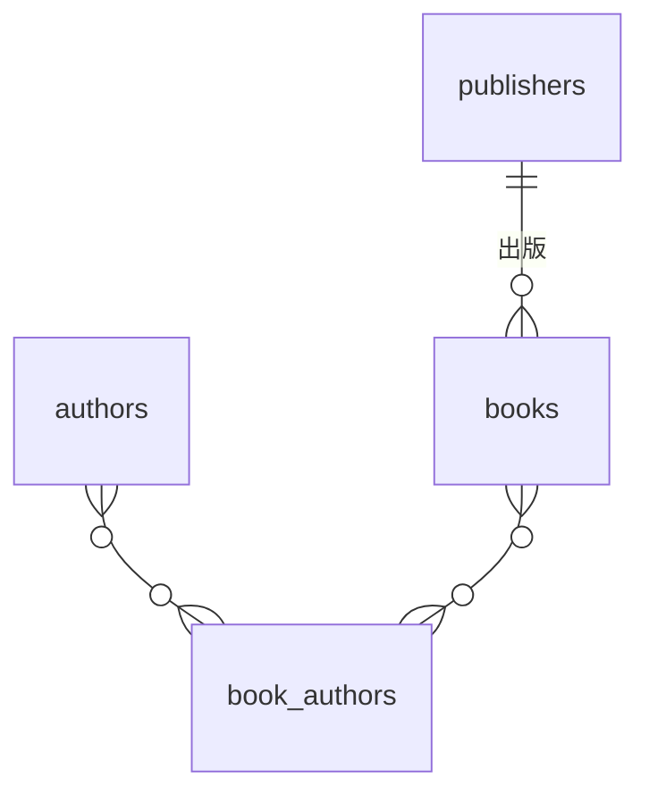

## はじめに

図書館でよくある書籍検索システムで「著者名、書籍タイトル、出版社名」を統合的に検索する場合を考えます。直感的には`OR`条件で実装しますが、データ量が増えるとパフォーマンスが問題になることがあります。

本記事では、PostgreSQL 17環境で以下の2つのアプローチを実測データで比較します。

- OR条件 + DISTINCT: 74.1 ms
- UNION ALL + DISTINCT: 18.2 ms（実行時間約1/4）

実行計画（EXPLAIN ANALYZE）の比較を通じて、このケースで`UNION ALL + DISTINCT`が高速になった理由を解説します。

## 検証環境

### PostgreSQL環境

- PostgreSQL 17
- Docker環境

### テーブル構造

典型的な図書館システムにありそうな正規化されたテーブル構造を使用します。

```sql
-- 出版社テーブル
CREATE TABLE publishers (
    publisher_id SERIAL PRIMARY KEY,
    name VARCHAR(255) NOT NULL
);

-- 著者テーブル
CREATE TABLE authors (
    author_id SERIAL PRIMARY KEY,
    name VARCHAR(255) NOT NULL
);

-- 書籍テーブル
CREATE TABLE books (
    book_id SERIAL PRIMARY KEY,
    title VARCHAR(500) NOT NULL,
    publisher_id INT REFERENCES publishers(publisher_id)
);

-- 書籍-著者の中間テーブル（多対多）
CREATE TABLE book_authors (
    book_id INT REFERENCES books(book_id),
    author_id INT REFERENCES authors(author_id),
    PRIMARY KEY (book_id, author_id)
);
```

### リレーションシップ



### データ件数

| テーブル | 件数 | 「夏目」マッチ |
|---------|------|---------------|
| publishers | 1,000 | 100件（10%） |
| authors | 5,000 | 50件（1%） |
| books | 100,000 | 500件（0.5%） |
| book_authors | 100,000 | - |

### インデックス

外部キーと検索対象カラム（name, title）にインデックスを設定しています。

本記事ではクエリ構造の比較が目的のため、詳細なインデックス戦略には触れません。

## 2つのアプローチ

### パターン1: OR条件 + DISTINCT

最も素直な実装です。
私も小規模なシステムで特にレイテンシの目標などがなければ、まずはこう書きます。

```sql
SELECT DISTINCT b.book_id, b.title
FROM books b
INNER JOIN book_authors ba ON b.book_id = ba.book_id
INNER JOIN authors a ON ba.author_id = a.author_id
INNER JOIN publishers p ON b.publisher_id = p.publisher_id
WHERE
  a.name LIKE '%夏目%' OR
  b.title LIKE '%夏目%' OR
  p.name LIKE '%夏目%';
```

実行時間: 74.1 ms

### パターン2: UNION ALL + DISTINCT

次に、各検索条件を独立したクエリに分割し、`UNION ALL`で結合後、最後に重複除去を行います。

```sql
SELECT DISTINCT * FROM (
  SELECT b.book_id, b.title
  FROM books b
  INNER JOIN book_authors ba ON b.book_id = ba.book_id
  INNER JOIN authors a ON ba.author_id = a.author_id
  WHERE a.name LIKE '%夏目%'

  UNION ALL

  SELECT b.book_id, b.title
  FROM books b
  WHERE b.title LIKE '%夏目%'

  UNION ALL

  SELECT b.book_id, b.title
  FROM books b
  INNER JOIN publishers p ON b.publisher_id = p.publisher_id
  WHERE p.name LIKE '%夏目%'
) sub;
```

実行時間: 18.2 ms（実行時間約1/4）

## 実測結果

| パターン | 実行時間 | 相対時間 | 返却行数 |
|---------|---------|---------|---------|
| OR条件 + DISTINCT | 74.1 ms | - | 11,500 |
| UNION ALL + DISTINCT | 18.2 ms | **約1/4** | 11,500 |
| (参考) UNION | 26.3 ms | 約1/3 | 11,500 |

## なぜUNION ALL + DISTINCTが高速なのか

### 1. 処理する行数の違い

| パターン | 処理行数 |
|---------|---------|
| OR条件 | 100,000行全体を処理 → 88,500行を除外 |
| UNION ALL + DISTINCT | 11,500行のみ処理 |

OR条件では、すべてのテーブルを結合してから条件でフィルタリングするため、大量の行を処理してから大部分を除外することになります。

### 2. JOIN戦略の違い

**OR条件:**
- すべてのテーブルをJOINする必要がある
- 著者だけで検索する場合も、出版社テーブルまで結合する（無駄）

**UNION ALL + DISTINCT:**
- 各クエリが必要なテーブルだけを結合
- 著者検索は著者テーブルのみ、出版社検索は出版社テーブルのみ

### 3. 重複除去のタイミング

**OR条件:**
- 結合後に`DISTINCT`で重複除去

**UNION ALL + DISTINCT:**
- すべて結合してから最後に1回だけ重複除去

### 4. 並列実行

`UNION ALL + DISTINCT`では**Parallel Append**（並列実行）が発動します。

Parallel Append（並列実行）が発動し、複数のサブクエリを並列に実行できるため、これが最速化の主な要因となります。

## 実行計画の比較

### パターン1: OR条件 + DISTINCT

```
HashAggregate (actual time=70.0..70.9ms rows=11500)
  -> Hash Join (publisher_id)
       Join Filter: (著者 OR タイトル OR 出版社) にマッチ
       Rows Removed by Filter: 88500  ← 88%を除外
       -> Hash Join (author_id)
            -> Hash Join (book_id)
                 -> Seq Scan on book_authors (100,001行)
                 -> Hash -> Seq Scan on books (100,000行)
            -> Hash -> Seq Scan on authors (5,000行)
       -> Hash -> Seq Scan on publishers (1,000行)

Execution Time: 74.1 ms
```

**特徴:**
- すべてのテーブルをINNER JOINで結合
- すべてSequential Scan
- 100,000行を処理してから88,500行をフィルタで除外
- 最後にHashAggregateで重複除去

### パターン2: UNION ALL + DISTINCT

```
HashAggregate (actual time=16.9..17.6ms rows=11500)
  -> Gather (並列実行)
       Workers Planned: 2
       Workers Launched: 2
       -> Parallel Append
            -> Hash Join (出版社検索: 10,000行)
                 -> Seq Scan on books
                 -> Hash -> Seq Scan on publishers (100件ヒット)
            -> Seq Scan on books (タイトル検索: 500行)
            -> Nested Loop (著者検索: 1,001行)
                 -> Nested Loop
                      -> Seq Scan on authors (50件ヒット)
                      -> Bitmap Heap Scan on book_authors
                           -> Bitmap Index Scan
                 -> Index Scan on books (books_pkey使用)

Execution Time: 18.2 ms
```

**特徴:**
- **並列実行（Parallel Append）が発動** - 2ワーカーで処理
- 各サブクエリが独立して最適化
- Nested Loop + Index Scanを活用
- 最後に1回だけ重複除去

## 再現環境

本検証環境はGitHubで公開しています：
https://github.com/cozy-corner/or-vs-union-all

## いつこの手法を使うべきか

### 有効なケース

以下の条件を満たす場合、UNION ALL + DISTINCTが有効です：

**1. 各検索条件の選択性が高い（少数の行を返す）**
- OR条件は全体を処理してから大部分を除外（本記事：100,000行→11,500行）
- 選択性が高いほど、この無駄が大きくなる

**2. 並列実行が可能な環境**
- Parallel Appendが発動することが最大の優位性
- PostgreSQLで`max_parallel_workers_per_gather > 0`

### 向かないケース

**1. 選択性が低い（大量の行を返す）**
- OR条件の無駄が少なくなり、性能差が縮まる

**2. テーブルが小さい**
- 並列実行のオーバーヘッドの方が大きくなる可能性がある

まずOR条件で実装し、パフォーマンス問題が発生したら`EXPLAIN ANALYZE`で比較して選択することを推奨します。

## まとめ

- UNION ALL + DISTINCTで実行時間約1/4化を実現
- 並列実行（Parallel Append）が主な要因
- データ特性に応じた使い分けが必要
- EXPLAIN ANALYZEでの実測確認が重要
